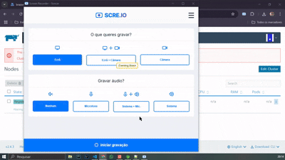

# Serviço de Orquestração de Conteiners [ SOC ]

Projeto que gerencia as informações de implementação e configuração do orquestrador de containers docker

## Dns

Crie uma vm e configure o dns __rancher.{dominio} para o ip publico dela.

## Rancher

Nessa etapa será instalado e configurado o software rancher para gerenciamento dos containers e cluster.

### Instalação Rancher

Execute os comandos abaixos no terminal da vm destinada ao rancher server.

```bash
sudo apt-get -y update && sudo apt install -y docker.io && \
sudo docker run -d --name rancher-server --restart=always -v /opt/rancher:/var/lib/rancher  -p 80:80 -p 443:443 --privileged rancher/rancher:v2.4.3
```

### Configuração Rancher

Através do dns __rancher.{dominio.com}__ acesse a interface gráfica da aplicação e configure os seguintes passos:

- Cluster: Crie um cluster conforme exemplificado no video: </br> 

Ao final do processo será disponibilizado um comando bash como exemplo abaixo: 

```bash
$ docker run -d --privileged --restart=unless-stopped --net=host -v /etc/kubernetes:/etc/kubernetes -v /var/run:/var/run rancher/rancher-agent:v2.4.3 --server https://rancher.dev-ops-ninja.com --token 8xf5r2ttrvvqcxdhwsbx9cvb7s9wgwdmgfbmzr4mt7smjbg4jgj292 --ca-checksum 61ac25d1c389b26c5c9acd98a1c167dbfb394c6c1c3019d855901704d8bae282 --node-name k8s-1 --etcd --controlplane --worker
```

Guardeo para as próximas etapas:

- Nodes: Cria as demais máquinas virtuais destinadas aos node do cluste e execute o comando reservado na etapa anterior no terminal:

```bash
$ docker run -d --privileged --restart=unless-stopped --net=host -v /etc/kubernetes:/etc/kubernetes -v /var/run:/var/run rancher/rancher-agent:v2.4.3 --server https://rancher.dev-ops-ninja.com --token 8xf5r2ttrvvqcxdhwsbx9cvb7s9wgwdmgfbmzr4mt7smjbg4jgj292 --ca-checksum 61ac25d1c389b26c5c9acd98a1c167dbfb394c6c1c3019d855901704d8bae282 --node-name k8s-1 --etcd --controlplane --worker
```

---

- Namespace: Através da ferramenta de upload do rancher com o namespace __DEFAULT__ selecionado, carregue deployment.yml do diretório namespace, conforme exemplificado no vídeo: </br> 

## Traefik

Nessa etapa iremos instalar e configurar o trafiek para proxy reverso das aplicações, para isso faça upload com o namespace __KUBE-SYSTEM__ selecionado dos arquivos do diretório __traefik__

## Longhorn

```bash
kubectl apply -f https://raw.githubusercontent.com/longhorn/longhorn/v1.9.0/deploy/longhorn.yaml
```

## Application

Para validar nossa instalação e configuração execute o arquivo grafana.yml, que deverá esta disponível no dns: __grafana-exemplo.app.{dominio.com.br}